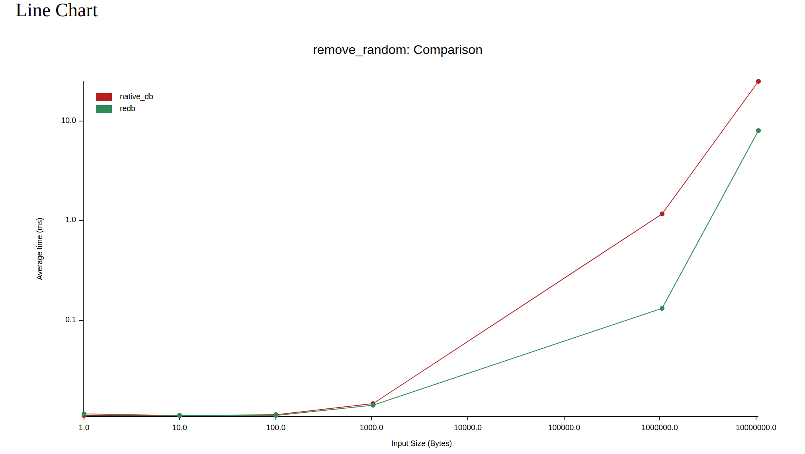

# Benchmarks

Highlight the Native DB overhead compared to direct access to the underlying database ([redb](https://github.com/cberner/redb)).

The benchmarks ignore:
- [`native_model`](https://github.com/vincent-herlemont/native_model) overhead.
- Serialization overhead used by `native_model` like `bincode`,`postcard` etc.
- The fact that `redb` can write the data using zero-copy.

## Run benchmarks

If you want to run the benchmarks, you need to install [just](https://github.com/casey/just), [nushell](https://www.nushell.sh/) and run:
```bash
just bench
```

## Results

We can see that the overhead is very low. These result are obtained with the version `0.5.3` of `native_db`.

### By input size



